# 课程设计

**课程名称：** <u>私有云平台架构与实践</u>

**题　　目：** <u>项目部署文档</u>

**学　　院：** <u>示范性软件学院</u>

**学生姓名：** <u>马　志　荣</u>

**学　　号：** <u>2300770089</u>

**年　　级：** <u>2023级</u>

**专业班级：** <u>软工2301</u>

**任课教师：** <u>丁　玺　润</u>

**完成日期：** <u>2026年6月30日</u>

---

## 目录

- [第一章　概述](#第一章-概述)
  - [1.1 文档目的](#11-文档目的)
  - [1.2 项目架构说明](#12-项目架构说明)
  - [1.3 部署原则](#13-部署原则)
- [第二章　部署环境准备](#第二章-部署环境准备)
  - [2.1 软件环境要求](#21-软件环境要求)
  - [2.2 项目结构目录](#22-项目结构目录)
- [第三章　中间件启动](#第三章-中间件启动)
  - [3.1 MySQL 启动](#31-mysql-启动)
  - [3.2 Redis 启动](#32-redis-启动)
  - [3.3 MinIO 启动](#33-minio-启动)
- [第四章　后端项目部署](#第四章-后端项目部署)
  - [4.1 后端配置文件修改](#41-后端配置文件修改)
  - [4.2 数据库初始化](#42-数据库初始化)
  - [4.3 后端项目打包](#43-后端项目打包)
  - [4.4 后端服务启动](#44-后端服务启动)
  - [4.5 后端部署验证](#45-后端部署验证)
- [第五章　前端项目部署](#第五章-前端项目部署)
  - [5.1 前端依赖安装](#51-前端依赖安装)
  - [5.2 前端环境配置](#52-前端环境配置)
  - [5.3 前端项目构建与启动](#53-前端项目构建与启动)
  - [5.4 前端部署验证](#54-前端部署验证)
- [第六章　本地服务部署](#第六章-本地服务部署)
  - [6.1 直播媒体服务器](#61-直播媒体服务器)
  - [6.2 DeepFilterNet3 降噪服务](#62-deepfilternet3-降噪服务)
  - [6.3 Live Guard 视觉审核服务](#63-live-guard-视觉审核服务)
  - [6.4 Live Agent AI 智能体服务](#64-live-agent-ai-智能体服务)
- [第七章　前后端联调验证](#第七章-前后端联调验证)
  - [7.1 服务启动顺序](#71-服务启动顺序)
  - [7.2 功能验证清单](#72-功能验证清单)
- [第八章　部署总结](#第八章-部署总结)

---

## 第一章　概述

### 1.1 文档目的

本文档为 PulseLive 直播平台的**前后端分离部署规范**，详细说明系统从环境准备、中间件启动、后端部署、前端构建、本地AI服务启动到联调验证的全流程操作步骤。本文档是开发、测试、运维人员完成项目发布与上线的技术依据，确保部署流程标准化、系统运行稳定。

### 1.2 项目架构说明

本项目采用**前后端分离 + 微服务架构**：

- **前端：** Vue 3 + Vite，负责页面渲染与用户交互，支持直播观看、聊天、礼物打赏等功能；
- **管理后台：** Vue 2 管理端，负责用户管理、直播审核、数据统计等后台管理功能；
- **后端：** Spring Boot 2.5.8，提供 RESTful 业务接口服务，集成 Netty WebSocket 实现实时聊天与 WebRTC 信令；
- **直播媒体服务器：** Node.js + node-media-server，提供 RTMP 推流与 HTTP-FLV 拉流能力；
- **AI 服务：** 包含 DeepFilterNet3 实时音频降噪、YOLOv8 视觉内容审核、LLM 智能直播助手三个独立服务；
- **数据层：** MySQL 8.x（业务数据存储）、Redis（缓存与会话）、MinIO（文件/封面对象存储）；
- **第三方服务：** 阿里云短信验证码、支付宝沙箱支付、QQ邮箱 SMTP。

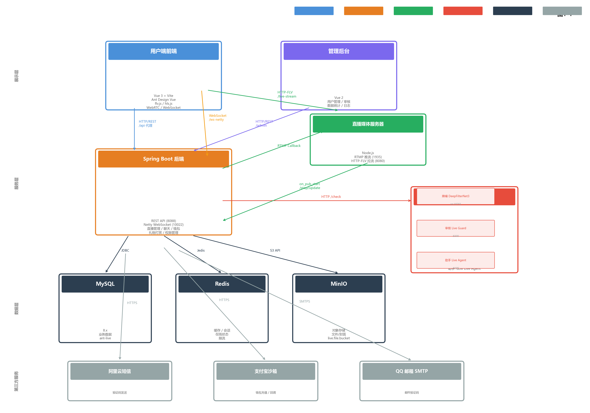

**图1-1 系统架构图**

### 1.3 部署原则

1. 先启动基础中间件（MySQL、Redis、MinIO），再启动后端及AI服务，最后启动前端；
2. 本地开发采用原生构建 + 直接运行方式部署，不使用 Docker 容器；
3. 配置文件与业务代码分离，生产环境敏感信息通过环境变量注入，不写入配置文件；
4. 直播媒体服务器、AI模型服务需与后端同时运行，方可完整体验直播功能；
5. 部署完成后必须完成全功能联调验证。

---

## 第二章　部署环境准备

### 2.1 软件环境要求

#### 2.1.1 后端运行环境

**表2-1 后端运行环境表**

| 软件名称 | 版本要求 | 用途 |
| --- | --- | --- |
| JDK | 8 及以上 | Java 运行环境 |
| Maven | 3.6 及以上 | 后端项目打包构建 |
| MySQL | 8.x | 业务数据存储 |
| Redis | 最新稳定版 | 登录状态、缓存、在线状态、限流 |
| MinIO | 最新稳定版 | 文件/图片/封面资源存储 |

#### 2.1.2 前端运行环境

**表2-2 前端运行环境表**

| 软件名称 | 版本要求 | 用途 |
| --- | --- | --- |
| Node.js | 18 及以上 | 前端项目构建运行 |
| npm | 随 Node.js 安装 | 前端依赖管理 |

#### 2.1.3 AI 服务运行环境

**表2-3 AI服务运行环境表**

| 软件名称 | 版本要求 | 用途 |
| --- | --- | --- |
| Python | 3.9 及以上 | AI 模型服务运行 |
| pip | 随 Python 安装 | Python 依赖管理 |
| PyTorch | 2.x（CUDA 可选） | 深度学习推理框架 |
| FFmpeg | 最新稳定版 | 直播流编解码（媒体服务器依赖） |

### 2.2 项目结构目录

```
项目根目录/
├─ backend/                          Spring Boot 后端项目
│  ├─ src/main/java/                 业务接口、直播、聊天、钱包、审核等后端代码
│  ├─ src/main/resources/            application.yml、SQL、Mapper
│  ├─ settings.xml                   Maven 本地仓库配置
│  └─ pom.xml                        Maven 依赖管理
├─ frontend/                         Vue 3 + Vite 用户端前端
│  ├─ src/api/                       API 请求封装
│  ├─ src/views/                     页面与业务视图
│  ├─ src/utils/                     WebRTC、降噪、字幕等前端工具
│  └─ vite.config.js                 本地开发代理配置
├─ admin-frontend/                   Vue 2 管理后台前端
├─ local-services/
│  ├─ live-server/                   本地 RTMP / HTTP-FLV 直播媒体服务器
│  └─ broadcast-simulator/          直播推流模拟脚本
├─ ai-services/
│  ├─ deepfilternet3/                DeepFilterNet3 实时降噪
│  │  ├─ engine/                     模型推理代码
│  │  ├─ server/                     WebSocket 降噪服务
│  │  └─ weights/                    预训练模型权重
│  ├─ vision-guard/                  视觉审核服务
│  │  ├─ server/                     FastAPI 审核服务
│  │  └─ weights/                    YOLOv8l + YOLOv8l-pose 权重
│  └─ live-agent/                    AI 直播智能助手
├─ scripts/                          启动/停止与演示脚本
│  ├─ start-demo.ps1                 一键启动演示环境
│  ├─ demo-live.ps1                  演示数据播种脚本
│  └─ stop-demo.ps1                  停止演示环境
├─ docs/
│  ├─ deployment/                    部署文档与数据库初始化SQL
│  └─ reports/                       技术报告
├─ .env                              本地环境变量（机密信息，不提交Git）
├─ .env.example                      环境变量模板
└─ application.yml                   后端全局配置
```

---

## 第三章　中间件启动

本章为项目部署核心前置步骤，需依次启动 MySQL、Redis、MinIO 三大中间件，确保所有基础服务正常运行后，再进行后端项目部署。

### 3.1 MySQL 启动

**步骤：**

```powershell
# 启动 MySQL 服务（Windows 服务方式）
net start mysql80

# 或直接启动 mysqld
mysqld --console
```

**启动验证：** 使用 MySQL Workbench 或命令行连接，确认服务可用。

```powershell
mysql -u root -p -e "SHOW DATABASES;"
```

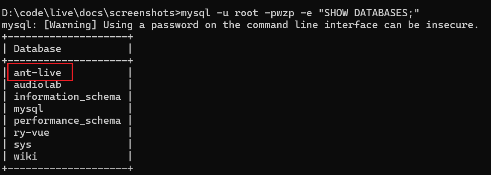

**图3-1 MySQL 服务启动验证**

### 3.2 Redis 启动

**步骤：**

```powershell
# 进入 Redis 安装目录，启动 Redis 服务
redis-server.exe redis.windows.conf

# 或直接启动（使用默认配置）
redis-server
```

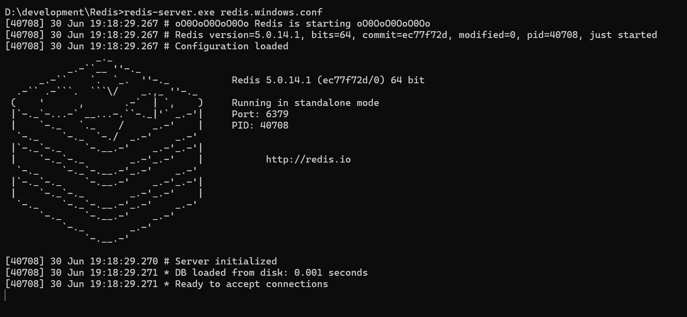

**图3-2 Redis 服务启动验证**

### 3.3 MinIO 启动

**步骤：**

```powershell
# 进入 MinIO 安装目录，指定存储路径启动
.\minio server D:\minio\data --address ":9000" --console-address ":9001"
```

**创建存储桶并设置公开读权限：**

```powershell
# 配置 MinIO Client 别名
mc alias set local http://127.0.0.1:9000 minioadmin minioadmin

# 创建存储桶
mc mb --ignore-existing local/live.file.bucket

# 设置公开读取权限
mc anonymous set download local/live.file.bucket
```

**启动验证：** 浏览器访问 `http://localhost:9001`，使用 `minioadmin / minioadmin` 登录 MinIO Console，确认 `live.file.bucket` 桶已创建。

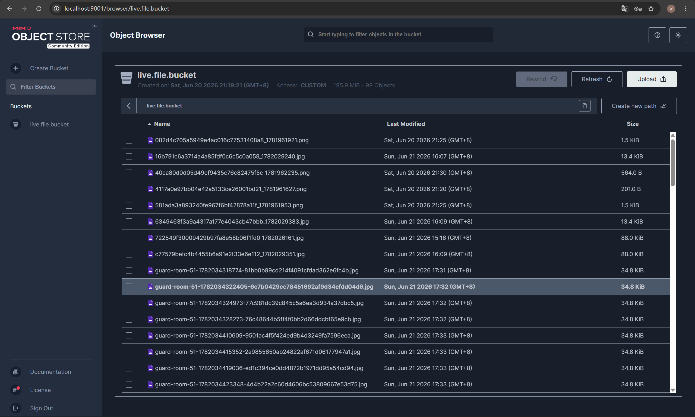

**图3-3 MinIO 服务启动验证**

---

## 第四章　后端项目部署

后端核心负责用户登录、直播管理、聊天消息、钱包充值、文件上传、AI 审核等业务接口提供，部署核心为改配置 → 初始化库 → 打包 → 启动。

### 4.1 后端配置文件修改

#### 4.1.1 配置文件路径

- 全局配置：`application.yml`（项目根目录）
- 本地环境覆盖：`backend/src/main/resources/application-local.yml`
- 环境变量：`.env`（项目根目录）

#### 4.1.2 核心配置项说明

**服务端口：**

```yaml
server:
  port: 8088    # 后端 API 服务端口
```

**数据源配置：**

```yaml
spring:
  datasource:
    url: jdbc:mysql://服务器地址:3306/ant-live?characterEncoding=utf-8&serverTimezone=GMT%2b8
    username: 数据库用户名
    password: ${DB_PASSWORD:}    # 通过环境变量注入，默认空
```

**Redis 配置：**

```yaml
spring:
  redis:
    host: Redis服务器地址
    port: 6379
    database: 0
    password: ${REDIS_PASSWORD:}
```

**MinIO 配置：**

```yaml
minio:
  endpoint: http://MinIO服务器地址:9000
  ip: MinIO服务器IP
  port: 9000
  accessKey: MinIO访问账号
  secretKey: MinIO访问密钥
  bucketName: live.file.bucket
```

**直播流配置（application-local.yml）：**

```yaml
lal:
  secret: ${LAL_SECRET:local-pulselive}
  rtmpPushStream: ${LAL_RTMP_PUSH_STREAM:rtmp://127.0.0.1:1935/live/}
  flvPullStream: ${LAL_FLV_PULL_STREAM:http://127.0.0.1:8080/live/}
  hlsPullStream: ${LAL_HLS_PULL_STREAM:}    # 本地优先 FLV
```

**AI 审核配置：**

```yaml
guard:
  enabled: true
  endpoint: http://localhost:8300/check
  intervalSeconds: 2    # 审核截图间隔
```

**支付宝沙箱配置：**

```yaml
alipay:
  enabled: true
  gatewayUrl: https://openapi-sandbox.dl.alipaydev.com/gateway.do
  appId: "9021000163606120"
  appPrivateKey: ${ALIPAY_APP_PRIVATE_KEY:}
  alipayPublicKey: ${ALIPAY_PUBLIC_KEY:}
  notifyUrl: http://公网穿透地址/api/v1/wallet/alipay/notify
  returnUrl: http://前端地址/#/center/dollar/wallet
  syncReturnUrl: http://公网穿透地址/api/v1/wallet/alipay/return
```

**阿里云短信配置：**

```yaml
aliyun:
  sms:
    enabled: true
    accessKeyId: ${ALIYUN_SMS_ACCESS_KEY_ID:}
    accessKeySecret: ${ALIYUN_SMS_ACCESS_KEY_SECRET:}
    endpoint: dypnsapi.aliyuncs.com
    signName: "速通互联验证码"
    templateCode: "100001"
```

**邮箱 SMTP 配置：**

```yaml
spring:
  mail:
    host: smtp.qq.com
    username: QQ邮箱地址
    password: ${MAIL_PASSWORD:}    # QQ邮箱SMTP授权码
    port: 465
    protocol: smtps
```

### 4.2 数据库初始化

**步骤：**

1. 登录 MySQL，创建项目数据库：

```sql
CREATE DATABASE IF NOT EXISTS `ant-live`
  DEFAULT CHARACTER SET utf8mb4
  COLLATE utf8mb4_general_ci;
```

2. 执行初始化 SQL 脚本：

```powershell
mysql -u root -p ant-live < docs\deployment\ant-live.sql
```

3. 验证：数据库中生成 `user`、`room`、`wallet`、`gift`、`chat_message`、`auth` 等相关表即为初始化成功。

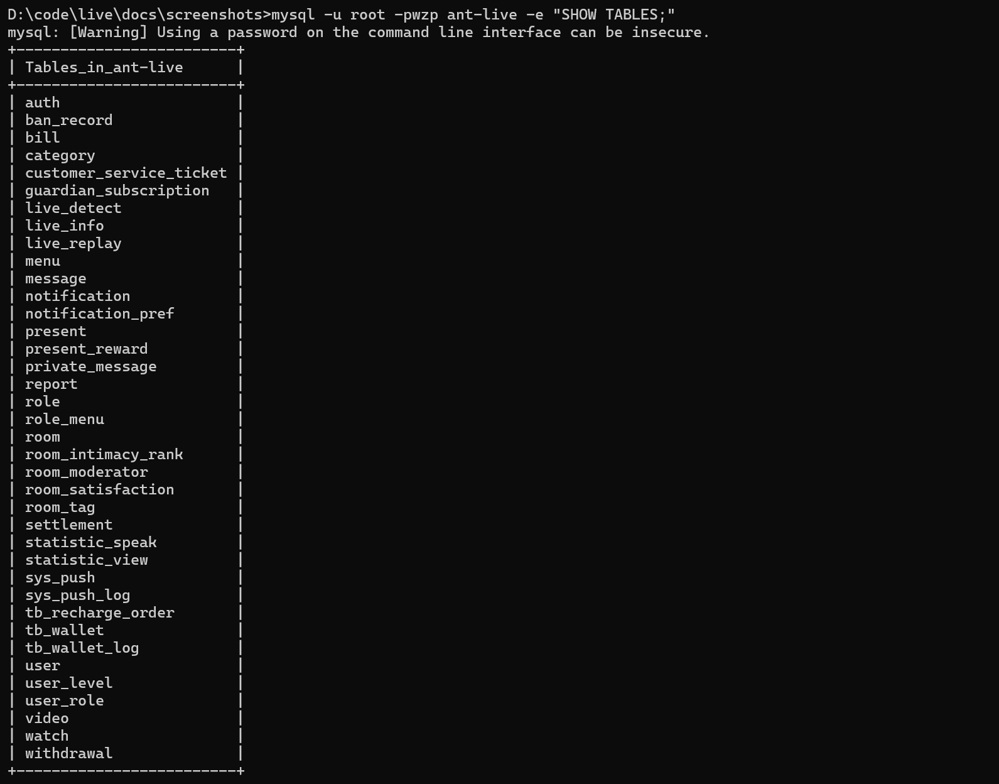

**图4-1 数据库初始化验证**

### 4.3 后端项目打包

**步骤：**

```powershell
# 1. 进入后端项目目录
cd backend

# 2. 执行 Maven 打包命令（跳过测试）
mvn -s .\settings.xml clean package -DskipTests
```

3. 打包成功后，在 `backend/target` 目录生成可运行 JAR 包：`backend-1.0.0.RELEASE.jar`

### 4.4 后端服务启动

**方式一：JAR 包启动（生产推荐）：**

```powershell
java -jar target/backend-1.0.0.RELEASE.jar
```

**方式二：Maven 插件启动（开发推荐）：**

```powershell
cd backend
mvn -s .\settings.xml spring-boot:run
```

**启动成功标志：** 控制台输出 `Started Application in X.XXX seconds`，8088 端口正常监听，无数据库、Redis、MinIO 连接报错。

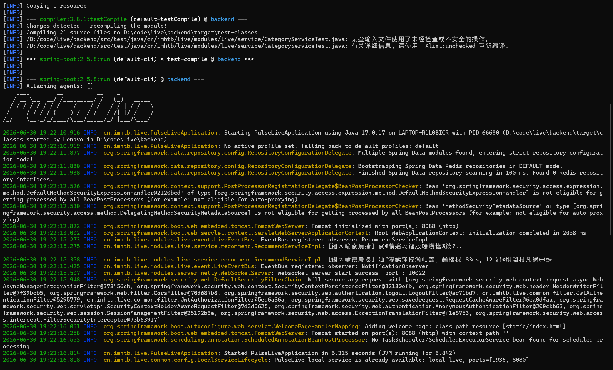

**图4-2 后端服务启动**

### 4.5 后端部署验证

后端启动后需验证以下内容：

1. 控制台无 MySQL、Redis、MinIO 连接报错；
2. 8088 端口正常监听（`netstat -ano | findstr 8088`）；
3. Netty WebSocket 端口 10022 正常监听；
4. 所有中间件可正常访问；
5. 接口无跨域、连接失败问题。

---

## 第五章　前端项目部署

前端负责页面展示与用户交互，部署核心为装依赖 → 改配置 → 启动。

### 5.1 前端依赖安装

```powershell
# 1. 进入前端项目目录
cd frontend

# 2. 安装依赖包
npm install
```

### 5.2 前端环境配置

前端项目通过 `.env` 文件配置运行参数：

**开发环境（`.env`）：**

```env
VITE_APP_PORT=5173
VITE_APP_BASE_API=/api
VITE_BACKEND_URL=http://localhost:8088
```

**备用开发环境（`.env.dev`）：**

```env
VITE_APP_PORT=5174
VITE_APP_BASE_API=/api
```

**Vite 代理配置说明（`vite.config.js`）：**

| 代理路径 | 目标地址 | 用途 |
| --- | --- | --- |
| `/api` | `http://localhost:8088` | 后端 REST API |
| `/uploads` | `http://localhost:8088` | 上传文件访问 |
| `/live.file.bucket` | `http://localhost:9000` | MinIO 文件存储 |
| `/ws-netty` | `ws://localhost:10022` | 聊天/信令 WebSocket |
| `/ws/browser-live` | `ws://localhost:8088` | 浏览器直播 WebSocket |
| `/live-stream` | `http://localhost:8080` | HTTP-FLV 直播拉流 |

### 5.3 前端项目构建与启动

**开发模式启动（推荐）：**

```powershell
cd frontend

# 使用默认 .env 配置（端口 5173）
npm run dev

# 或使用 .env.dev 配置（端口 5174）
npm run dev -- --mode dev
```

**生产构建：**

```powershell
cd frontend

# 构建生产版本
npm run build

# 构建成功后，使用 serve 启动静态服务
npx serve -s dist -l 3000
```

**访问地址：**
- 开发模式：`http://localhost:5173/` 或 `http://localhost:5174/`（以终端输出为准）
- 生产模式：`http://localhost:3000/`

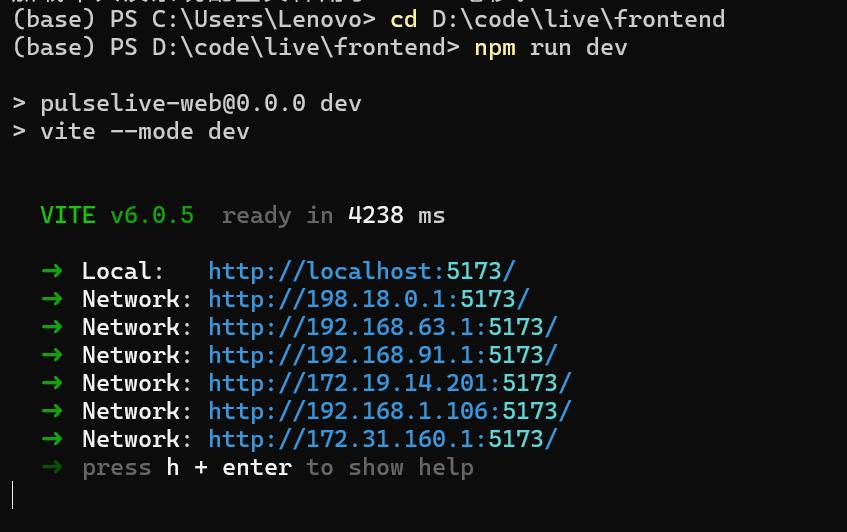

**图5-1 用户端前端启动**

### 5.4 前端部署验证

1. 浏览器可正常打开页面，无白屏、资源加载 404；
2. 前端代理正确转发后端接口，Network 面板无 404/500/CORS 报错；
3. 直播列表加载正常，路由跳转、按钮交互正常；
4. WebSocket 连接正常（聊天、信令功能可用）。

---

## 第六章　本地服务部署

除前后端外，PulseLive 依赖多个本地服务实现完整的直播功能。本章按启动顺序说明各服务的部署步骤。

### 6.1 直播媒体服务器

直播媒体服务器基于 Node.js + node-media-server，提供 RTMP 推流和 HTTP-FLV 拉流能力。

**服务端口：**

| 协议 | 端口 | 用途 |
| --- | --- | --- |
| RTMP | 1935 | 主播端推流入口 |
| HTTP-FLV | 8080 | 观众端直播拉流 |

**启动步骤：**

```powershell
cd local-services\live-server
npm install
npm start
```

**配置说明（`server.js`）：**

```javascript
const config = {
  rtmp: {
    port: 1935,
    chunk_size: 60000,
  },
  http: {
    port: 8080,
    allow_origin: '*',
  },
};
```

**前置依赖：** 需系统安装 FFmpeg 并配置环境变量（推流转码依赖）。

**推流地址示例：** `rtmp://127.0.0.1:1935/live/{roomId}`

**拉流地址示例：** `http://127.0.0.1:8080/live/{roomId}.flv`

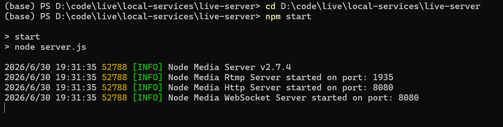

**图6-1 直播媒体服务器启动**

### 6.2 DeepFilterNet3 降噪服务

DeepFilterNet3 是基于深度学习的实时音频降噪服务，通过 WebSocket 与前端交互。

**服务端口：** WebSocket `ws://127.0.0.1:18765/ws`

**启动步骤：**

```powershell
# 使用项目 Python 虚拟环境启动
ai-services\live-agent\.venv\Scripts\python.exe ai-services\deepfilternet3\server\server.py
```

**前置依赖安装：**

```powershell
# 安装降噪服务依赖
ai-services\live-agent\.venv\Scripts\python.exe -m pip install -r ai-services\deepfilternet3\server\requirements.txt
```

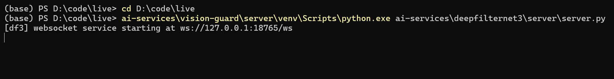

**图6-2 降噪服务启动**

### 6.3 Live Guard 视觉审核服务

Live Guard 基于 YOLOv8 模型的视觉内容审核服务，用于直播截图的自动内容安全审核。

**服务端口：** HTTP `http://127.0.0.1:8300/check`

**启动步骤：**

```powershell
# 使用项目 Python 虚拟环境启动
ai-services\live-agent\.venv\Scripts\python.exe ai-services\vision-guard\server\vision_guard.py
```

**前置依赖安装：**

```powershell
ai-services\live-agent\.venv\Scripts\python.exe -m pip install -r ai-services\vision-guard\server\requirements.txt
```

**API 接口：**
- `POST /check` — 提交直播截图进行内容审核
- `GET /docs` — Swagger API 文档

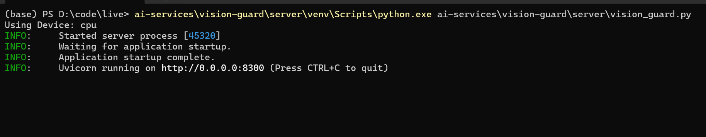

**图6-3 视觉审核服务启动**

### 6.4 Live Agent AI 智能体服务

Live Agent 是基于 LLM 的直播智能助手服务，提供智能对话、直播互动等功能。

**服务端口：** HTTP `http://127.0.0.1:8100`

**配置说明（`.env`）：**

```env
PULSELIVE_LLM_BASE_URL=http://localhost:8000/v1
PULSELIVE_LLM_MODEL=Qwen1.5-1.8B
PULSELIVE_LLM_API_KEY=
PULSELIVE_LLM_TIMEOUT=60
```

**启动步骤：**

```powershell
ai-services\live-agent\.venv\Scripts\python.exe ai-services\live-agent\server.py
```

**健康检查地址：** `http://localhost:8100/api/agent/health`

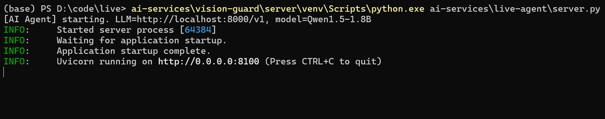

**图6-4 AI 智能体服务启动**

---

## 第七章　前后端联调验证

### 7.1 服务启动顺序

| 顺序 | 服务 | 端口 | 说明 |
| --- | --- | --- | --- |
| 1 | MySQL | 3306 | 数据库服务，所有业务数据存储 |
| 2 | Redis | 6379 | 缓存服务，会话与在线状态 |
| 3 | MinIO | 9000/9001 | 对象存储，文件与封面 |
| 4 | 直播媒体服务器 | 1935/8080 | RTMP 推流 + HTTP-FLV 拉流 |
| 5 | DeepFilterNet3 降噪 | 18765 | 实时音频降噪 WebSocket |
| 6 | Live Guard 审核 | 8300 | 视觉内容审核 |
| 7 | Live Agent 智能体 | 8100 | AI 直播助手 |
| 8 | Spring Boot 后端 | 8088/10022 | REST API + WebSocket |
| 9 | Vue 3 前端 | 5173/5174 | 用户端页面 |
| 10 | 内网穿透（可选） | — | NATAPP 支付宝回调 | **最后启动** |

### 7.2 功能验证清单

**表7-1 功能验证清单表**

| 验证模块 | 验证内容 | 预期结果 |
| --- | --- | --- |
| 基础功能 | 页面打开、注册登录 | 正常打开页面，注册/登录成功，获取 Token |
| 直播管理 | 创建直播间、开始/结束直播 | 开播成功，RTMP 推流正常 |
| 直播观看 | 进入直播间、观看直播流 | HTTP-FLV 拉流正常，画面流畅 |
| 实时聊天 | 发送/接收聊天消息、弹幕 | WebSocket 连接正常，消息实时同步 |
| 礼物打赏 | 发送礼物、余额扣减 | 动画正常播放，钱包余额正确变动 |
| 钱包充值 | 支付宝沙箱充值 | 生成订单，跳转支付，回调入账 |
| 文件上传 | 头像/封面上传 MinIO | 上传成功，返回可访问链接 |
| AI 降噪 | 开播时开启降噪 | WebSocket 连接降噪服务，音频质量提升 |
| AI 审核 | 直播自动截图审核 | 截图定时发送审核服务，违规内容告警 |
| AI 助手 | 直播间智能对话 | LLM 正常响应，对话记录正确 |
| 管理后台 | 用户管理、直播审核、数据统计 | 功能正常，操作日志可查 |
| 日志监控 | 后端/浏览器控制台 | 无持续异常报错 |

> **📷 截图说明：** 针对每个验证模块截取 1-2 张关键页面截图，重点展示功能正常运行的状态。
> - 用户端首页（直播列表）
> - 直播间页面（视频播放 + 聊天 + 礼物）
> - 钱包充值页面
> - 管理后台数据统计页面

---

## 第八章　部署总结

本 PulseLive 直播平台通过原生构建 + 直接运行的方式完成全部服务部署，完整流程为：环境准备 → 中间件启动（MySQL、Redis、MinIO）→ 本地服务启动（直播媒体服务器、降噪、审核、AI助手）→ 数据库初始化 → 后端配置打包启动 → 前端配置启动 → 联调验证。

**部署要点回顾：**

1. **中间件先行：** MySQL、Redis、MinIO 是后端启动的前置条件，务必先启动并验证可用；
2. **本地服务按序启动：** 直播媒体服务器 → 降噪服务 → 审核服务 → AI助手，最后启动后端；
3. **敏感信息保护：** 数据库密码、API密钥、支付宝密钥等均通过环境变量（`.env`）注入，不写入配置文件；
4. **内网穿透配置：** 如需测试支付宝充值，需使用 NATAPP 等工具将后端 8088 端口暴露到公网，并同步更新 `alipay.notifyUrl` 和 `alipay.syncReturnUrl`；
5. **端口管理：** 项目使用 10+ 端口，部署前需确保端口未被占用，详见 README.md 中的端口表。

部署完成后需保留各服务运行日志，定期检查 MySQL、Redis、MinIO、直播服务器、AI服务状态，确保系统长期稳定运行。

---

## 附录：端口与地址速查表

| 模块 | 服务 | 端口/地址 | 说明 |
| --- | --- | --- | --- |
| 前端 | Vite dev server | `http://localhost:5173/` | 用户端开发模式 |
| 前端（备用） | Vite dev server | `http://localhost:5174/` | `.env.dev` 配置 |
| 后端 | Spring Boot API | `http://localhost:8088/` | REST 业务接口 |
| 后端 WebSocket | Netty | `ws://localhost:10022/` | 聊天、礼物、WebRTC 信令 |
| 直播服务器 | RTMP 推流 | `rtmp://127.0.0.1:1935/live/` | 主播推流入口 |
| 直播服务器 | HTTP-FLV 拉流 | `http://127.0.0.1:8080/live/` | 观众拉流 |
| Redis | Redis | `localhost:6379` | 缓存、会话、在线状态 |
| MySQL | MySQL | `localhost:3306/ant-live` | 业务数据库 |
| MinIO | MinIO API | `http://localhost:9000` | 对象存储 API |
| MinIO | MinIO Console | `http://localhost:9001` | 对象存储管理界面 |
| 降噪服务 | DeepFilterNet3 | `ws://127.0.0.1:18765/ws` | 实时音频降噪 |
| 审核服务 | Live Guard | `http://127.0.0.1:8300/check` | 直播内容审核 |
| AI 助手 | Live Agent | `http://127.0.0.1:8100/` | 直播智能助手 |
| 邮箱 | QQ SMTP | `smtp.qq.com:465` | 邮件验证码（外部服务） |
| 短信 | 阿里云短信 | `dypnsapi.aliyuncs.com` | 短信验证码（外部服务） |
| 支付 | 支付宝沙箱 | `openapi-sandbox.dl.alipaydev.com` | 充值支付（外部服务） |
