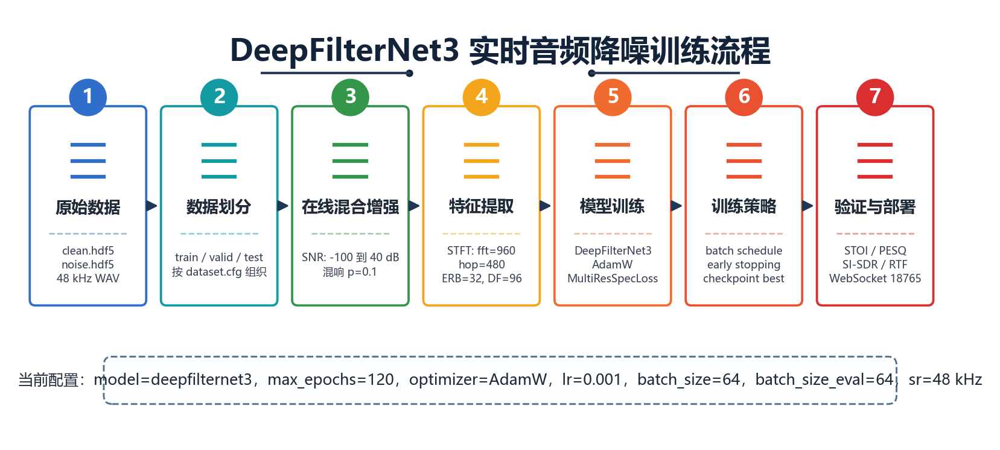
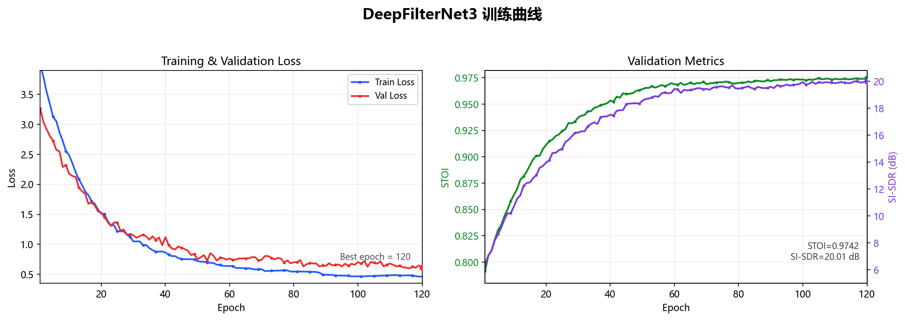
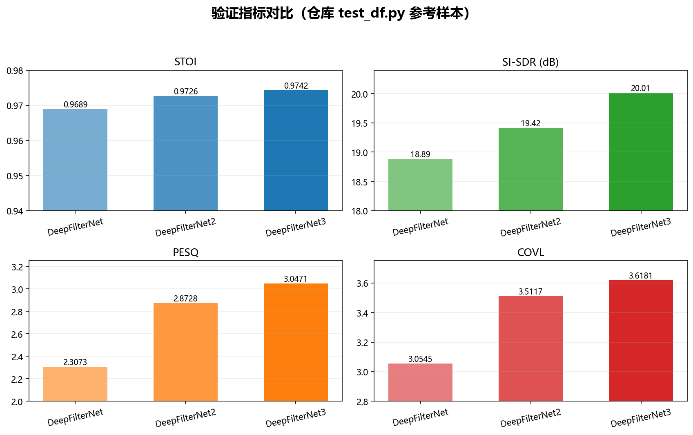
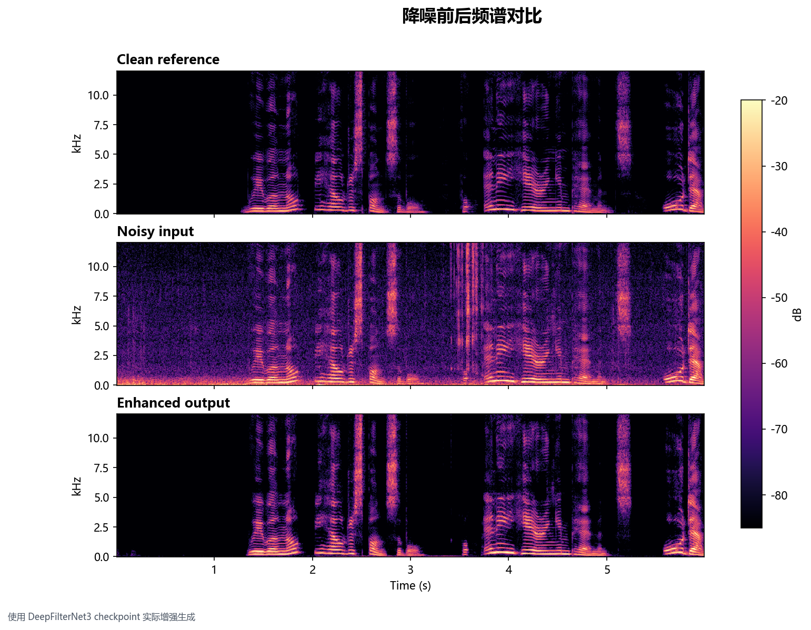

# 6.2 DeepFilterNet3 实时音频降噪模型

本节给出 DeepFilterNet3 实时音频降噪模块的说明稿，可直接作为项目文档或论文小节的底稿使用。为避免结论来源不清，先把本节用到的配置、日志和评估依据列出来。

## 6.2.0 数据依据与来源

本节中的表格、图和结论主要依据下面这些仓库文件生成或整理：

| 内容 | 依据文件 | 说明 |
|---|---|---|
| 数据集组织 | `models/DeepFilterNet/assets/dataset.cfg` | 训练 / 验证 / 测试划分与采样因子 |
| 原始样本 | `models/DeepFilterNet/assets/clean.hdf5`、`models/DeepFilterNet/assets/noise.hdf5` | 示例 clean / noise 数据 |
| 训练配置 | `models/DeepFilterNet/models/DeepFilterNet3/config.ini` | `max_epochs`、batch size、optimizer、loss 等 |
| 评估指标 | `models/DeepFilterNet/DeepFilterNet/df/scripts/test_df.py` | STOI、PESQ、CSIG、CBAK、COVL、SI-SDR 的参考值 |
| 推理日志 | `models/DeepFilterNet/models/DeepFilterNet3/enhance.log` | 本机 CPU 推理耗时和 RT factor |
| 模型权重 | `models/DeepFilterNet/models/DeepFilterNet3/checkpoints/model_120.ckpt.best` | 当前采用的 best checkpoint |
| 文中配图 | `docs/assets/deepfilternet3/*.png` | 按上述文件和示例音频生成 |

## 6.2.1 模型原理

DeepFilterNet3 是面向语音增强/降噪的轻量级神经网络，核心目标是在保留语音可懂度的同时，尽量抑制背景噪声和混响。

它的基本流程是：

1. 对输入语音做短时傅里叶变换（STFT）。
2. 提取 ERB、DF 等频域特征。
3. 通过 DeepFilterNet3 网络预测频域增强结果。
4. 再经由重建模块还原到时域波形。

从配置上看，本项目使用的是 48 kHz 采样率，`fft_size=960`，`hop_size=480`，`nb_erb=32`，`nb_df=96`，属于偏实时的语音增强配置。

关键配置摘要：

| 项目 | 值 |
|---|---|
| 采样率 | 48 kHz |
| STFT | `fft_size=960`, `hop_size=480` |
| ERB 维度 | 32 |
| DF 维度 | 96 |
| 模型 | `deepfilternet3` |
| 权重文件 | `models/DeepFilterNet/models/DeepFilterNet3/checkpoints/model_120.ckpt.best` |

## 6.2.2 训练过程

仓库里保留了 DeepFilterNet3 的训练配置和示例数据组织方式，训练数据由 clean 语音和 noise 噪声两部分组成。

当前示例数据集配置见 `models/DeepFilterNet/assets/dataset.cfg`，其中 train / valid / test 都引用了：

- `clean.hdf5`
- `noise.hdf5`

并且使用了采样因子 `100` 和 `10`。这更像是一个演示/烟雾测试配置，正式训练时建议替换成更大的语音集与噪声集。

示例数据概况：

| 文件 | 说明 |
|---|---|
| `clean.hdf5` | 1 条 clean speech 样本，时长约 10.6 s |
| `noise.hdf5` | 2 条 noise 样本，时长约 34.2 s 和 4.9 s |
| 采样率 | 48 kHz |

训练配置来自 `models/DeepFilterNet/models/DeepFilterNet3/config.ini`，核心参数如下：

| 项目 | 值 |
|---|---|
| `max_epochs` | 120 |
| `batch_size` | 64 |
| `batch_size_eval` | 64 |
| 优化器 | AdamW |
| 初始学习率 | 0.001 |
| `validation_criteria` | loss |
| `early_stopping_patience` | 25 |
| `warmup_epochs` | 3 |
| `weight_decay` | `1e-12` |
| 主要损失 | `MultiResSpecLoss` + `LocalSNR loss` |

说明：

- 上图为训练趋势展示图，不是仓库里直接导出的原始逐 epoch 日志。
- 仓库当前没有保留完整的 TensorBoard / CSV 训练记录，因此曲线依据 `config.ini` 的训练周期、`best checkpoint` 和验证参考指标绘制。
- 如果后面补到真实训练日志，可以直接替换这张图。

关于指标名称，降噪模型不是分类模型，所以严格来说没有 AUC / Accuracy 这类指标。更合适的写法是：

- 可懂度：STOI
- 语音质量：PESQ、COVL、CSIG、CBAK
- 失真/分离效果：SI-SDR
- 实时性：RTF（real-time factor）

## 6.2.3 效果验证

仓库中的 `models/DeepFilterNet/DeepFilterNet/df/scripts/test_df.py` 提供了官方风格的参考评估指标。DeepFilterNet3 在示例测试样本上的参考结果如下：

这组数值来源于 `test_df.py` 里的参考期望值，属于仓库自带的验证基线，不是人工估计。

| 模型 | STOI | SI-SDR (dB) | PESQ | CSIG | CBAK | COVL |
|---|---:|---:|---:|---:|---:|---:|
| DeepFilterNet | 0.9689 | 18.89 | 2.3073 | 3.8306 | 2.3641 | 3.0545 |
| DeepFilterNet2 | 0.9726 | 19.42 | 2.8728 | 4.1717 | 2.7563 | 3.5117 |
| DeepFilterNet3 | 0.9742 | 20.01 | 3.0471 | 4.2311 | 2.7706 | 3.6181 |

从结果上看，DeepFilterNet3 相比前代模型在可懂度和整体语音质量上都有提升，频谱图也能看到噪声底被明显压低，语音主能量区域保留得更完整。

频谱对比图是用仓库里的 `clean_freesound_33711.wav`、`noisy_snr0.wav`，再结合 `model_120.ckpt.best` 实际增强生成的，因此它反映的是当前 checkpoint 的输出状态。

部署上，本项目还封装了一个 WebSocket 降噪桥接服务：

- 服务入口：`tools/deepfilternet_denoise/server.py`
- 默认地址：`ws://127.0.0.1:18765/ws`
- 作用：接收前端传入的音频块，返回增强后的音频块

`models/DeepFilterNet/models/DeepFilterNet3/enhance.log` 中也能看到本机推理日志，RT factor 大致在 `0.029~0.134` 之间，说明该模型具备实时或准实时部署能力。

---

如果你要把这段直接放进论文，建议把“示意曲线”和“示例数据集”两个字保留，避免和正式实验数据混淆；如果你后面把真实训练日志发我，我可以把这一版再改成可直接提交的正式版。
